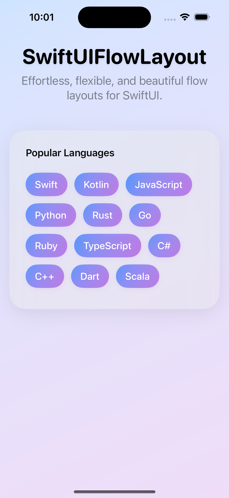
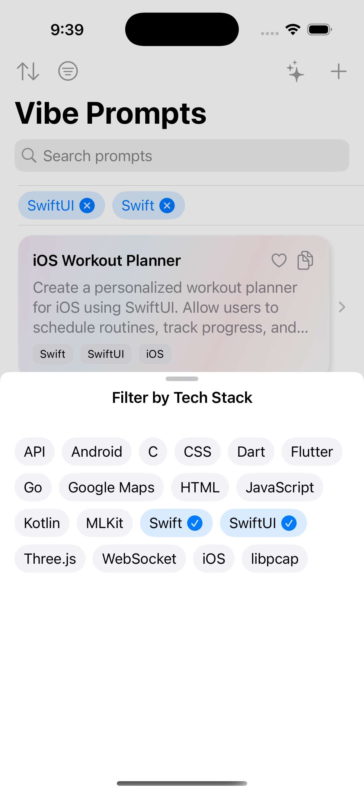

# SwiftUIFlowLayout

A lightweight and flexible FlowLayout for SwiftUI, supporting dynamic wrapping of views in a horizontal flow, similar to tag or chip layouts. Designed for easy integration and reuse in your SwiftUI projects.

## Screenshots

<p align="center">
  
  
</p>


## Features
- Arranges child views in a horizontal flow, wrapping to new lines as needed
- Customizable horizontal and vertical spacing
- Simple API using generics and @ViewBuilder
- Supports iOS 14+

## Installation

### Swift Package Manager
Add this package to your `Package.swift`:

```swift
.package(url: "https://github.com/banghuazhao/swiftui_flow_layout.git", branch: "main")
```

Or use Xcode: File > Add Packages... and enter the repository URL.

## Usage

```swift
import SwiftUIFlowLayout

struct ExampleView: View {
    let tags = ["Swift", "UI", "Flow", "Layout", "Reusable"]
    var body: some View {
        FlowLayout(items: tags) { tag in
            Text(tag)
                .padding(8)
                .background(Color.blue.opacity(0.2))
                .cornerRadius(8)
        }
    }
}
```

## Usage Example

```swift
import SwiftUI
import SwiftUIFlowLayout

struct ExampleView: View {
    let tags = ["Swift", "Kotlin", "JavaScript", "Python", "Rust", "Go", "Ruby"]
    
    var body: some View {
        FlowLayout(items: tags, horizontalSpacing: 12, verticalSpacing: 12) { tag in
            Text(tag)
                .padding(.horizontal, 12)
                .padding(.vertical, 8)
                .background(Color.blue.opacity(0.2))
                .foregroundColor(.blue)
                .cornerRadius(8)
        }
        .padding()
    }
}
```

You can use `FlowLayout` in any SwiftUI view to arrange items in a flexible, wrapping layout.


## License
MIT 